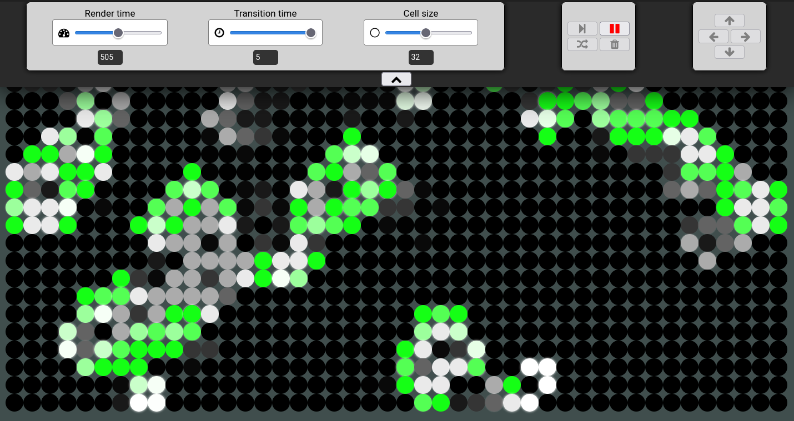

# Conway's Game of Life

In 1970, the British mathematician John Horton Conway devised a cellular
automaton by the name "Game of Life". It is a zero-player game, in that its
evolution is determined by its initial state, requiring no further input.
Interaction with the game is done by creating an initial configuration of cells,
and observing how the game evolves.

The rules of the game are as follows:

- Any live cell with fewer than two live neighbours dies, as if by
  underpopulation.
- Any live cell with two or three live neighbours lives on to the next
  generation.
- Any live cell with more than three live neighbours dies, as if by
  overpopulation.
- Any dead cell with exactly three live neighbours becomes a live cell, as if by
  reproduction.

## Rundown of the project:

Live cells are given the color white, and dead cells are colored black (green
means they've just been born).

The user can give life to cells by clicking and dragging over the board, or by
clicking the "shuffle" button in the top right. The game starts when the user
clicks on the "play" button in the top left.

Controls are given for interacting with the aesthetics and speed of the game, as
well as for shifting the cells around.

## Live link
You can follow [this link](https://r-game-of-life.herokuapp.com/) 
to check out a live instance of the project

## Installing and running the project:
To install any missing dependencies:

### `npm install`

And to launch the game:

### `npm start`

##
